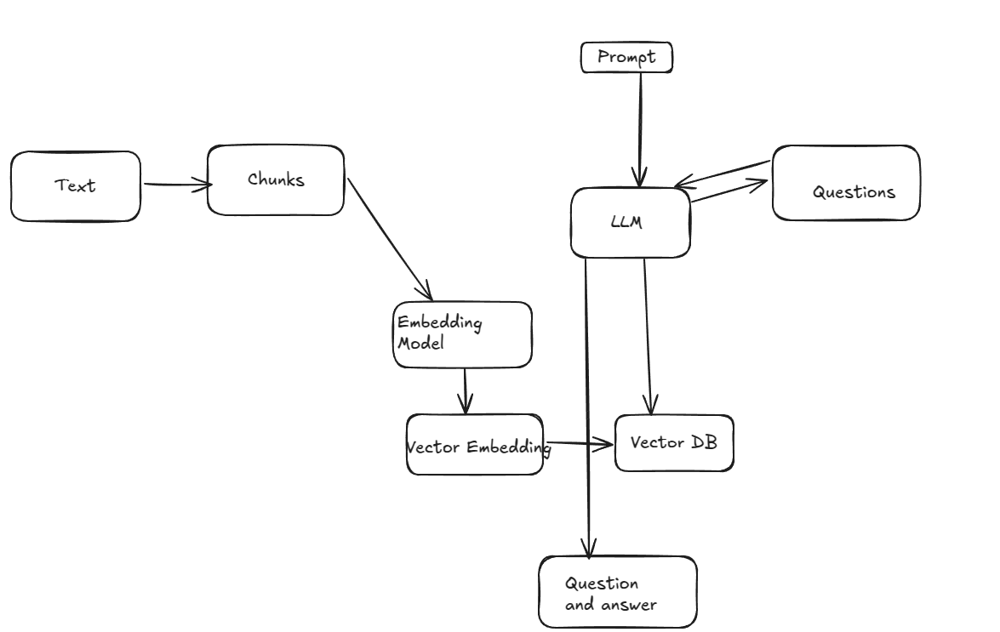

# lm-works-ashok
LM Works 1) QA Creator 


 

### why we need chunking , why chunking is required ?
Chunking is the process of breaking down large pieces of data—like a long document, article, or dataset—into smaller, manageable pieces (chunks) before processing them, often for tasks like embedding or storing in a vector database.

### Model Limitations:
Most embedding models (e.g., BERT, GPT-based models) have a fixed input size limit—say, 5
eg:

128,000 context window - gpt 4.0
16,385 context window  - gpt 3.5 GPT-3.5 Turbo.

 If you try to feed in a 10-page document, it’ll either get truncated (losing information) or fail. Chunking splits the document into smaller bits (e.g., 500-token chunks) that fit within these limits, ensuring no data is lost.

Chunking breaks it into sections, embeds each, and lets a vector database pinpoint the relevant part.


### Embedding Model: 
A model that is designed to turn raw data (e.g., text, images, or even audio into numerical representations called vector embeddings (numerical arrays) capturing meaning. Input: “soft cotton T-shirt”; Output: [0.12, -0.45, 0.89, …]. These vectors capture semantic relationships

### Vector Embedding: 
The output of the embedding model is the vector embedding itself
The numerical output itself, representing data in a way machines can compare. Use case: Measuring similarity between items.
The closer these vectors are mathematically (e.g., via cosine similarity), the more similar the items are in meaning

### Vector Database: 
Stored these vector embeddings in a vector database, like Pinecone or FAISS, which is optimized for fast similarity searches. Unlike traditional databases that match exact keywords, a vector DB uses the numerical distances between vectors to find “close” matches

Its bascically a storage and retrieval system for embeddings, enabling fast, meaning-based searches. Use case: Powering recommendations or search engines.


## How to run 

1)Create an virtual environment and activate

```
eg: 
 conda create -n intqa python=3.10 -y
 conda activate intqa

```

Stack Used : Langchain, FAstAPI, FAISS, OPENAI, Embedding models 


2. install requirements
   pip install -r requirements.txt 

## Deploying  this app on EC2 instance

Login with your AWS console and launch an EC2 instance

2. Run the following commands
Note: Do the port mapping to this port:- 8511 - as per the given in app.py

sudo apt update
sudo apt-get update
sudo apt upgrade -y
sudo apt install git curl unzip tar make sudo vim wget -y
 
git clone "Your-repository"
Note : create a .env file and add keys 

sudo apt install python3-pip

sudo apt install python3-venv
python3 -m venv .venv
source .venv/bin/activate


pip3 install -r requirements.txt

#Temporary running
python3 app.py 

#Permanent running
nohup python3 app.py